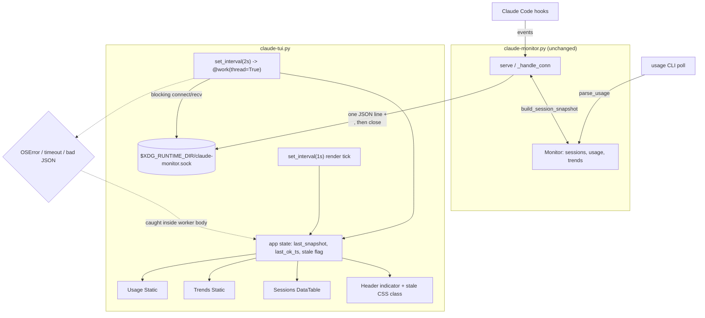

# Phase 9: Terminal Dashboard (claude-tui.py) - Research

**Researched:** 2026-07-21
**Domain:** `textual` TUI rendering + unix-socket client + packaging a first non-stdlib runtime dependency
**Confidence:** HIGH (load-bearing claims read from the installed `textual` 8.2.8 source and verified by execution on this machine)

<user_constraints>
## User Constraints (from CONTEXT.md)

### Locked Decisions

- **D-01:** Static three-panel single column, no tabs and no navigation. Usage block fixed at top, trends block fixed below it, sessions table takes all remaining space and scrolls internally when it overflows. The screen is glanceable like the tray menu -- everything visible without a keypress. Approved shape:

  ```
  +----------------------------------------+
  | claude-tui            14:32  * live    |
  +----------------------------------------+
  | 5h   62%  1.2M tok  resets 1h04  380/m |
  | 7d   41%  8.9M tok  resets 3d02   210/m|
  +----------------------------------------+
  | trends                                 |
  |  _..-=#=-._..--=##=-.._                |
  |  today 410k/hr | wk 260k/hr            |
  |  peak hour: 15:00 (720k/hr)            |
  +----------------------------------------+
  | SESSIONS                               |
  | waiting  claude-code-tray      2m14s   |
  | running  phd                   11m03s  |
  | done     dotfiles              1h22m   |
  +----------------------------------------+
  | q quit                                 |
  +----------------------------------------+
  ```

- **D-02:** Header (title + clock + a live/stale indicator) and footer (`q quit`). Exactly one key binding: `q`. No manual-refresh key, no theme toggle -- the refresh is automatic (TUI-04) so a manual one has nothing to add.
- **D-03:** Sessions sort order is waiting -> running -> done, matching the v1.4 dashboard panel's semantics (TUI-03). Columns: status, project dir, time-in-state.
- **D-04:** The socket snapshot is the *only* data source. The TUI never opens `usage-history.jsonl` and never runs `claude` itself.
- **D-05:** Trends are rendered from the snapshot's `trends` field **verbatim** -- those are already the exact row strings `core.build_trend_rows` produced for the tray menu. The TUI does not recompute them and does not call the trend functions itself. This satisfies TUI-02 ("reusing core's existing trend functions, not reimplementing them") by construction and guarantees the TUI and the tray menu can never disagree. Consequence, accepted: the sparkline is fixed at the tray's 24 columns and does not widen with the terminal.
- **D-06:** Keep core's existing Unicode block `SPARK_GLYPHS`. No ASCII variant, no second glyph set -- a divergence from the tray's rendering is the thing to avoid. (Deliberate exception to the ASCII-only house rule; the glyphs already ship in `claude_monitor/core.py` and already render in the tray menu.)
- **D-07:** `trends` is `None` while history spans less than `TREND_MIN_SPAN` (`build_trend_rows` returns `None` in the collecting state). The trends panel must render a "collecting" message for that case, not an empty box or a crash.
- **D-08:** Query the socket on a fixed 2-second interval, *not* the daemon's poll interval. Rationale: sessions change on hook events, not on the daemon's usage-poll clock, so matching the poll interval would make the live sessions panel laggy -- the panel is the reason the TUI queries the socket rather than reading a file. Repeated identical usage rows between daemon polls are the accepted cost.
- **D-09:** Running sessions tick locally every second between snapshots -- derive elapsed from `entered` + the local clock, exactly as the v1.4 web dashboard does. Waiting/done sessions show the snapshot's `frozen` value as-is, so a stopped session's counter stops climbing. Two timers: 2s fetch, 1s re-render.
- **D-10:** If at least one snapshot has ever been received, a failed query keeps the last data on screen (dimmed) and flips the header indicator to `daemon unreachable -- last update HH:MM:SS`. It never wipes good data off the screen for a one-off blip, and it clears itself silently when the socket comes back.
- **D-11:** On cold start with no daemon ever reached, show a single clear centered message instead of empty panels. Never a traceback to the terminal.
- **D-12:** Retry forever on the same 2s interval. No backoff, no failure cap, no exit. The TUI is a long-lived window; leaving it open across a `just restart` must Just Work.

### Claude's Discretion

- Widget choice within `textual` (Static/DataTable/custom), styling/CSS, and the exact module split between `claude-tui.py` and any helper -- planner's call.
- Where the socket-query helper lives (a small function in `claude-tui.py` vs. a `claude_monitor.core` addition). Note that `core.py` is deliberately `gi`-free; the query client is `gi`-free too, so either home is viable.
- Exact `textual` version pin and whether it lands in `dependencies` or an optional extra, provided a plain `./claude-tui.py` works after `install.sh`.

### Deferred Ideas (OUT OF SCOPE)

- **Click-to-focus a pane from the TUI** (the `pane`/`tmux` fields are in the snapshot, unused here) -- deferred at v1.5 planning; the tray stays the focus surface.
- **Standalone no-daemon mode** reading `usage-history.jsonl` directly -- deferred at v1.5 planning; shared-socket was chosen to get live sessions into v1.5 scope.
- **Terminal-width sparkline** -- rejected for this phase as the cost of D-05. Revisit only if the fixed 24 columns actually reads badly on a wide terminal.
- **Manual refresh / theme toggle keys** -- rejected under D-02; auto-refresh makes the first redundant and the second is not a v1.5 problem.
</user_constraints>

<phase_requirements>
## Phase Requirements

| ID | Description | Research Support |
|----|-------------|------------------|
| TUI-01 | Shows current usage (%, tokens, reset countdown, burn rate) for both 5h and 7d caps | Usage dict shape verified at `core.py:249-289` (`parse_usage`); the exact seven keys and their `None` cases are enumerated in *The Data Contract* below. Formatters already exist (`fmt_tokens`, `fmt_countdown`, `fmt_countdown_wk`) |
| TUI-02 | Shows trends reusing core's trend functions, not reimplementing | Satisfied by construction under D-05: `snapshot["trends"]` **is** `build_trend_rows`' return value (`claude-monitor.py:598`). Verified return shape below |
| TUI-03 | Live sessions panel, waiting -> running -> done | v1.4 semantics read verbatim from `dashboard.py:470-517`; sort rank, running-ticks/frozen split and empty-state string transcribed below |
| TUI-04 | Refreshes automatically on an interval | `MessagePump.set_interval` verified from `textual/message_pump.py:418-448`; two-timer pattern in *Pattern 2* |
| TUI-05 | Degrades cleanly, never an unhandled traceback | The two crash paths (`Timer._tick` -> `_handle_exception`, and `@work(exit_on_error=True)`) are verified from source and are **the** landmines of this phase -- see Pitfall 1 |
</phase_requirements>

## Summary

Nearly all of this phase is already decided. The only genuinely open technical territory is
`textual` itself, and the research turned up four things that will silently break D-10/D-11/D-12
if the planner does not encode them as acceptance criteria.

**First, textual exits the app on any unhandled exception -- in two different places, both of
which this phase uses.** `App._handle_exception` carries the docstring *"Always results in the
app exiting"* [VERIFIED: textual 8.2.8 `app.py:3263-3266`]. `Timer._tick` catches `Exception`
from a `set_interval` callback and routes it straight there [VERIFIED: `timer.py:187-195`], and
`@work(...)` defaults to `exit_on_error=True` [VERIFIED: `_work_decorator.py:44`]. D-12's "retry
forever, never exit" is therefore not free -- it is a `try/except Exception` inside the fetch
body, exactly the house posture from `poll_loop`/`serve`/`_handle_conn`. This is the single
highest-value finding here.

**Second, textual re-runs the Phase 5 Pango-markup lesson, and `DataTable` is worse than the
tray was.** Any plain `str` handed to `DataTable.add_row` is passed through
`Text.from_markup(content)` with **no `markup=False` opt-out on the widget**
[VERIFIED: `widgets/_data_table.py:200-224`]. A project directory named `[bold]x` is markup
injection into the sessions panel -- the same class of bug STATE.md's Blockers section calls out
for the notification body. The fix is one wrap: pass `rich.text.Text(s["dir"])`, which the same
function returns verbatim via its `is_renderable(obj) -> return obj` branch. `Static` at least
offers `markup=False` as a constructor argument [VERIFIED: `widgets/_static.py:19,32`].

**Third, packaging has a real obstacle that is not visible from `pyproject.toml`.** The
justfile runs the daemon on `/usr/bin/python3` (it needs system `gi`), and that interpreter is
PEP 668 externally-managed -- `/usr/lib/python3.12/EXTERNALLY-MANAGED` exists on this host, so
`pip install textual` into it refuses [VERIFIED: filesystem check]. Debian's packaged
`python3-textual` is **0.1.13** against the current 8.2.8, an API from a different universe
[VERIFIED: `apt-cache policy`]. But `claude-tui.py` does not need `gi` at all, so it does not
need that interpreter. The clean answer, executed and confirmed on this machine, is a PEP 723
inline-metadata script with a `#!/usr/bin/env -S uv run --quiet --script` shebang: it resolves
textual itself, needs no venv activation, works from any cwd, works through the `install.sh`
symlink, and still gets `sys.path[0]` pointed at the repo so `import claude_monitor` resolves.

**Primary recommendation:** `claude-tui.py` as a PEP 723 `uv run --script` entry point; three
`Static`-derived panels plus one `DataTable` in a `Vertical`; two `App.set_interval` timers (2s
fetch delegating to a `@work(thread=True, exit_on_error=False, exclusive=True)` worker, 1s
re-render) with a blanket `except Exception` inside the fetch body; a client socket timeout of
1.5s (shorter than the 2s interval); `rich.text.Text()` around every session `dir`; and a single
`set_class(stale, "stale")` toggle driving a CSS `text-opacity` rule for D-10's dimming.

## Architectural Responsibility Map

| Capability | Primary Tier | Secondary Tier | Rationale |
|------------|-------------|----------------|-----------|
| Usage/trend computation | Daemon (`claude-monitor.py` + `core.py`) | -- | Already done and cached by the daemon; the snapshot hands over finished values (D-05). The TUI computes nothing here |
| Session state of truth | Daemon `Monitor.sessions` | -- | Hook events reach only the daemon. The TUI is a read-only observer (D-04, REQUIREMENTS Out of Scope) |
| Snapshot transport | Unix socket (Phase 8, shipped) | -- | Fixed contract; nothing in `claude-monitor.py` changes |
| Socket client + JSON parse | `claude-tui.py` (or a `gi`-free `core` helper) | -- | Pure, `gi`-free, testable **above** the textual boundary -- this is where `--selfcheck` coverage lands |
| Sort key / elapsed formatting | Pure helper (importable without textual) | -- | Mirrors `dashboard.py:470-517` semantics; must be assertable from `test_claude_monitor.py` without a textual import |
| Layout, styling, timers, degraded-mode presentation | `textual` App | -- | The only tier that may import textual |
| Second-tick elapsed display | `textual` 1s timer reading local clock | Pure elapsed formatter | D-09: derived locally between 2s snapshots, exactly as the web dashboard does |

## Standard Stack

### Core

| Library | Version | Purpose | Why Standard |
|---------|---------|---------|--------------|
| `textual` | 8.2.8 (latest stable) | The TUI framework | Pre-decided in REQUIREMENTS.md; `curses` explicitly rejected at scoping [VERIFIED: REQUIREMENTS.md:37] |
| `rich` | >=14.2.0 (transitive) | `rich.text.Text` -- the markup-safe cell wrapper | Ships with textual, no separate declaration needed. Required for the `DataTable` escaping fix |
| `uv` | 0.7.1 (present) | Dependency resolution for the entry script | Already the project's Python tool per global CLAUDE.md; already produced `uv.lock` + `.venv` here |

`textual` 8.2.8 requires-python is `>=3.9,<4.0` [VERIFIED: PyPI JSON API]. The project pins
`requires-python = ">=3.11"` (`pyproject.toml:5`, matching `uv.lock:3`); the host runs 3.12.3.
No floor conflict.

Transitive install is 10 packages total [VERIFIED: executed `uv run --script` on this machine]:
`textual`, `rich`, `markdown-it-py[linkify]`, `mdurl`, `linkify-it-py`, `uc-micro-py`,
`mdit-py-plugins`, `platformdirs`, `pygments`, `typing-extensions`. The heavy `tree-sitter*` set
is behind the `syntax` extra and is **not** pulled in -- do not request that extra.

### Alternatives Considered

| Instead of | Could Use | Tradeoff |
|------------|-----------|----------|
| PEP 723 `uv run --script` shebang | `textual` in `[project.dependencies]` + `.venv` | Works, but `./claude-tui.py` then only runs with the venv activated or via `uv run claude-tui.py`. D-domain requires "a plain `./claude-tui.py` works after `install.sh`" -- this fails that bar unless `install.sh` rewrites the shebang |
| PEP 723 shebang | `pipx install`-style user install | `pipx` is present, but the project is not a distributable package (`uv.lock` marks it `source = { virtual = "." }`) -- there is nothing to `pipx install` |
| PEP 723 shebang | system `pip install --break-system-packages textual` | Fights PEP 668 deliberately and pollutes the system interpreter the daemon shares. Reject |
| PEP 723 shebang | `apt install python3-textual` | Debian ships **0.1.13** vs 8.2.8. Not a viable API [VERIFIED: `apt-cache policy python3-textual`] |

**Installation (recommended):**

```bash
# In pyproject.toml, for the checker/dev env only:
uv add --optional tui 'textual>=8,<9'
```

...and the runtime resolution lives in the script itself (see Pattern 1). Declaring it in an
optional `tui` extra keeps `uv sync` lean for the daemon-only path while giving basedpyright a
resolvable `textual` import (the checker reads the venv, not the PEP 723 block).

## Package Legitimacy Audit

| Package | Registry | Age | Downloads | Source Repo | Verdict | Disposition |
|---------|----------|-----|-----------|-------------|---------|-------------|
| `textual` | PyPI | ~4 yrs (0.1.0 through 8.2.8, 800+ releases) | unknown (seam returned null) | github.com/Textualize/textual | **SUS** | Approved -- see note |
| `rich`, `markdown-it-py`, `mdurl`, `linkify-it-py`, `uc-micro-py`, `mdit-py-plugins`, `platformdirs`, `pygments`, `typing-extensions` | PyPI | mature | -- | -- | not individually audited | Transitive, pinned by `uv.lock` |

**Note on the `textual` SUS verdict:** `gsd-tools query package-legitimacy check --ecosystem pypi
textual` returns `SUS` with reasons `["too-new", "unknown-downloads"]`. The `too-new` signal is
reading the **latest release date** (8.2.8, published 2026-06-30), not the package's age. The
registry shows an unbroken release history from 0.1.0 forward and the repo URL resolves to
`github.com/Textualize/textual` [VERIFIED: PyPI JSON API]. `textual` was also chosen by the user
at v1.5 scoping (REQUIREMENTS.md:11, "`textual` is the one exception to the project's
stdlib+PyGObject-only rule"), and I installed and executed 8.2.8 on this host during research.

**Planner guidance:** the `checkpoint:human-verify` the SUS verdict would normally require is
already discharged by the locked scoping decision. Do not add a redundant gate; do record the
verdict in the plan so the audit trail is honest.

**Packages removed due to [SLOP] verdict:** none
**Packages flagged as suspicious [SUS]:** `textual` (false positive on release recency, resolved above)

## The Data Contract (verified from source)

Everything the TUI renders comes from one JSON object. Verified shapes:

**Request/response wire format** [VERIFIED: `claude-monitor.py:573-614`]:
- Socket: `$XDG_RUNTIME_DIR/claude-monitor.sock`, mode 0600 [VERIFIED: `claude-monitor.py:32`]
- Server does one `recv(65536)`, splits on lines, and for `{"query": "snapshot"}` writes
  `json.dumps(snapshot) + "\n"` then `continue`s; the whole body's `finally` closes the socket.
- So: **one request line in, one response line out, then EOF.** Reading until `b"\n"` is the
  correct client pattern; reading to EOF also works because the daemon always closes.
- Server-side `conn.settimeout(5)`.

**`snapshot["usage"]`** -- `parse_usage`'s dict, or `None` when the daemon has no usage
[VERIFIED: `core.py:249-289`, `claude-monitor.py:65,352-357`]:

| Key | Type | `None` when |
|-----|------|-------------|
| `used_percentage` | number | never (parse returns `None` wholesale instead) |
| `resets_at_epoch` | number | never (same) |
| `burn_rate_per_min` | number | never (same) |
| `tokens_used` | number or `None` | `--api` mode returns percentages only |
| `token_limit` | number or `None` | same |
| `seven_day_pct` | number or `None` | older CLI omits the seven_day block |
| `seven_day_reset` | number or `None` | same |

The whole dict is `None` after `USAGE_MISS_LIMIT` consecutive failed polls
[VERIFIED: `claude-monitor.py:352-357`]. **TUI-01 must handle `usage is None`, `tokens_used is
None`, and `seven_day_pct is None` as three separate cases** -- the tray already does exactly
this at `claude-monitor.py:315-339` and that method is the reference rendering.

**`snapshot["trends"]`** -- `build_trend_rows`' return: `None`, or a `list[str]` of length 2 or 3
[VERIFIED: `core.py:489-512`]:
- `rows[0]` = the 24-char sparkline
- `rows[1]` = `"today 410k/hr | wk 260k/hr"`
- `rows[2]` = `"peak hour: 15:00 (720k/hr)"` -- **omitted entirely when `trend_peak_hour`
  returns `None`.** Index the list defensively; do not assume 3 rows.
- The tray's collecting-state string is `"trends: collecting history..."`
  [VERIFIED: `claude-monitor.py:344`]. D-07 should reuse it verbatim.

**`snapshot["sessions"]`** -- list of six-key dicts [VERIFIED: `core.py:153-172`]:
`dir` (str), `status` (str), `entered` (float or `None`), `frozen` (`None` when
`status == "running"`, else `run_dur`), `pane` (str, unused here), `tmux` (str, unused here).

**v1.4 sessions-panel semantics to mirror (D-03/D-09)** [VERIFIED: `dashboard.py:470-517`]:
- Rank map `{waiting: 0, running: 1, done: 2}`, unknown status sorts to `99`.
- Duration: `status == "running" and entered is not None` -> tick `now - entered`; else
  `frozen` if not `None`; else the literal string `"-"`.
- Under an hour, format as `"2m 14s"` so the counter visibly ticks; at/over an hour fall back to
  the coarser `fmtDur`.
- Empty state string: `"No active Claude Code sessions"`.

## Architecture Patterns

### System Architecture Diagram



The two arrows into `STATE` from two different timers are the whole design. Everything else is
layout.

### Recommended Project Structure

```
claude-code-tray/
├── claude-tui.py            # NEW: PEP 723 header + textual App + CSS. The only file that imports textual
├── claude_monitor/
│   ├── core.py              # + snapshot client helper and/or pure session helpers (gi-free, textual-free)
│   └── test_claude_monitor.py  # + asserts for the pure helpers (must NOT import textual)
├── pyproject.toml           # + [project.optional-dependencies] tui = ["textual>=8,<9"]
├── install.sh               # + symlink/entry for claude-tui.py
└── justfile                 # + `just tui` recipe
```

### Pattern 1: PEP 723 self-resolving entry script

```python
#!/usr/bin/env -S uv run --quiet --script
# /// script
# requires-python = ">=3.11"
# dependencies = ["textual>=8,<9"]
# ///
"""Terminal dashboard for claude-code-tray. Third consumer of claude_monitor.core."""
import sys, os, json, socket, time
from claude_monitor import core   # resolves via sys.path[0] == this file's real directory
```

Verified on this machine [VERIFIED: executed]:
- Cold run resolves and caches the env; warm runs add ~6ms and print nothing.
- `--quiet` suppresses the cold-run `Installed N packages` line so it cannot corrupt the first
  frame.
- `sys.path[0]` is the **resolved** script directory, so `import claude_monitor` works both when
  run as `./claude-tui.py` from the repo and through an `install.sh` symlink from elsewhere, and
  from any cwd. (Confirmed separately that plain `#!/usr/bin/env python3` + symlink resolves
  `sys.path[0]` the same way -- the existing `claude-monitor.py` behaviour is not a coincidence.)

`install.sh` should follow its existing posture (`ln -sf`, `claude-monitor.py:12-13`) and add a
symlink -- `~/.local/bin/claude-tui` is the natural target since this one is meant to be typed,
unlike the hook scripts. `just tui` should invoke the repo copy directly.

### Pattern 2: the two-timer refresh loop (D-08 + D-09)

```python
from textual import work
from textual.app import App

FETCH_INTERVAL = 2.0   # D-08
TICK_INTERVAL  = 1.0   # D-09
SOCK_TIMEOUT   = 1.5   # < FETCH_INTERVAL, see Pitfall 2

class ClaudeTui(App):
    BINDINGS = [("q", "quit", "quit")]   # D-02: exactly one

    def on_mount(self) -> None:
        self.set_interval(FETCH_INTERVAL, self.fetch)   # kicks the worker
        self.set_interval(TICK_INTERVAL, self.tick)     # local re-render only
        self.fetch()                                    # don't wait 2s for frame one

    @work(thread=True, exclusive=True, exit_on_error=False)
    def fetch(self) -> None:
        # ponytail: blanket except -- house posture from poll_loop/serve/_handle_conn.
        # A failed query is a state change (D-10), never a raised traceback (D-12).
        try:
            snap = query_snapshot()          # pure, blocking, testable
            self.call_from_thread(self.apply_snapshot, snap)
        except Exception:
            self.call_from_thread(self.mark_stale)
```

`MessagePump.set_interval(interval, callback, *, name=None, repeat=0, pause=False) -> Timer`
[VERIFIED: `textual/message_pump.py:418-448`]. It lives on `MessagePump`, so `App` and every
`Widget` both have it -- either owner works. Put both on the `App`: the state they mutate is
app-level, and one owner means one place to reason about D-12.

`@work(thread=True)` is the documented mechanism for blocking, non-async I/O
[CITED: https://textual.textualize.io/guide/workers/]. Thread workers must not touch widgets
directly -- use `self.call_from_thread(...)` or `self.post_message(...)`. `exclusive=True` means
a new fetch supersedes the previous worker record, but note Pitfall 2: it does **not** interrupt
a blocking `recv`.

### Pattern 3: the socket client (pure, `gi`-free, textual-free)

```python
def query_snapshot(path=SOCK, timeout=SOCK_TIMEOUT):
    """One request line out, one response line back, then the daemon closes. Raises on failure."""
    s = socket.socket(socket.AF_UNIX, socket.SOCK_STREAM)
    s.settimeout(timeout)
    try:
        s.connect(path)
        s.sendall(b'{"query": "snapshot"}\n')
        buf = b""
        while not buf.endswith(b"\n"):
            chunk = s.recv(65536)
            if not chunk:
                break               # daemon closed; buf is the whole line (or empty -> raise below)
            buf += chunk
        return json.loads(buf)
    finally:
        s.close()
```

Failure modes verified by execution on this host:

| Situation | Exception | Latency |
|-----------|-----------|---------|
| Daemon never started (no socket file) | `FileNotFoundError` | immediate, no timeout wait |
| Daemon killed, stale socket file left behind | `ConnectionRefusedError` | immediate |
| Daemon hung mid-response | `socket.timeout` | `SOCK_TIMEOUT` |
| Garbage response | `json.JSONDecodeError` | immediate |

Both socket errors subclass `OSError`, and `JSONDecodeError` subclasses `ValueError` -- a single
`except Exception` in the worker covers all four, and the two common ones (daemon down) return
instantly, so D-12's 2s retry loop costs nothing while the daemon is restarting.

### Pattern 4: widget choice per panel (D-01)

| Panel | Widget | Update mechanism | Why |
|-------|--------|------------------|-----|
| Usage (fixed 2 rows) | `Static(markup=False)` | `.update(text)` from the 1s tick | Two rows of pre-formatted text. A reactive + `render()` buys nothing over one `update()` call and adds a class |
| Trends (fixed 2-3 rows) | `Static(markup=False)` | `.update("\n".join(rows))` | D-05 says the rows are already finished strings. `markup=False` is mandatory -- the sparkline is fine but the burn strings are formatter output and `Static` parses `[` |
| Sessions (variable, scrolls) | `DataTable` | `.clear()` then `.add_rows(...)` each tick | Needs internal scrolling + column alignment. `clear(columns=False)` preserves the column definitions [VERIFIED: `_data_table.py:1582-1596`], so define columns once in `on_mount` |
| Header indicator | `Static` in a custom header row | `.update()` + `set_class(stale, "stale")` | D-02/D-10 |

Reactive attributes with `watch_` methods are the idiomatic textual answer
[CITED: https://textual.textualize.io/guide/reactivity/] and are genuinely better when a value
feeds `render()`. Here the panels are pre-formatted strings arriving from one place on one timer,
so imperative `.update()` is the shorter, more obvious code. `recompose=True` is definitively
wrong for the sessions table -- it destroys and rebuilds child widgets every second, losing
scroll position.

### Pattern 5: layout CSS for D-01

```css
Screen { layout: vertical; }

#usage  { height: auto; border-bottom: solid $panel; }
#trends { height: auto; border-bottom: solid $panel; }
#sessions { height: 1fr; }          /* takes the rest, scrolls internally */

.stale { text-opacity: 60%; }        /* D-10 dimming, toggled by set_class */
#coldstart { display: none; content-align: center middle; height: 1fr; }
```

`height: auto` shrinks to content, `height: 1fr` takes the remaining space
[CITED: https://textual.textualize.io/guide/layout/]. `DataTable` scrolls internally, so the
sessions panel satisfies D-01's "scrolls when it overflows" without a wrapping `VerticalScroll`.
`text_opacity` is a real style property [VERIFIED: `css/styles.py:108,321,1237`]; `dim` is also a
valid `text-style` value [VERIFIED: `css/constants.py:52`] if opacity reads badly on a given
theme.

`Header` and `Footer` ship as widgets (`textual/widgets/_header.py`, `_footer.py`). `Footer`
renders the `BINDINGS` list automatically, so D-02's `q quit` footer costs exactly the one
`BINDINGS` entry in Pattern 2 -- no footer code.

### Pattern 6: degraded mode (D-10 / D-11 / D-12)

```python
def apply_snapshot(self, snap):
    self.snapshot = snap
    self.last_ok = time.time()
    self.query_one("#coldstart").display = False
    self.set_class(False, "stale")        # clears itself silently (D-10)
    self.render_all()

def mark_stale(self):
    if self.snapshot is None:
        # D-11: cold start, never reached the daemon
        self.query_one("#coldstart").display = True
        self.query_one("#coldstart", Static).update(
            "claude-monitor daemon not running.\nStart it with: just start")
    else:
        # D-10: keep the good data, dim it, say so
        self.set_class(True, "stale")
        self.query_one("#status", Static).update(
            "daemon unreachable -- last update %s" % time.strftime("%H:%M:%S",
                                                                   time.localtime(self.last_ok)))
    # D-12: no counter, no backoff, no exit. The 2s timer just comes round again.
```

`DOMNode.set_class(add: bool, *class_names)` is a single call for the toggle
[VERIFIED: `textual/dom.py:1739`], with `add_class`/`remove_class` at `:1817`/`:1835` if the
boolean form reads worse.

### Anti-Patterns to Avoid

- **Blocking `socket.recv` directly in a `set_interval` callback.** The callback runs on the
  event loop; a 1.5s blocking read freezes the entire UI including the `q` binding. This is what
  the thread worker exists for [CITED: https://textual.textualize.io/guide/workers/].
- **Letting the fetch raise.** See Pitfall 1. Both containment points default to killing the app.
- **Passing raw `str` project dirs to `DataTable.add_row`.** See Pitfall 3.
- **`reactive(..., recompose=True)` on the sessions panel.** Rebuilds children every second and
  loses scroll position; also the most expensive option available.
- **Recomputing trends in the TUI.** Directly violates D-05 and defeats the "can never disagree"
  guarantee that satisfies TUI-02.
- **Importing `textual` from `claude_monitor/core.py` or `test_claude_monitor.py`.** `just
  selfcheck` runs `/usr/bin/python3 ... --selfcheck` (justfile:38), the interpreter that
  *cannot* have textual. Any such import turns the green-gate red on a clean machine.

## Don't Hand-Roll

| Problem | Don't Build | Use Instead | Why |
|---------|-------------|-------------|-----|
| Off-loop blocking I/O | A raw `threading.Thread` + `GLib`-style queue | `@work(thread=True)` + `call_from_thread` | Textual already owns worker lifetime, cancellation and DOM-node binding [CITED: workers guide] |
| Periodic callback | `asyncio.create_task` + `while True: await sleep()` | `App.set_interval` | Returns a `Timer` with pause/reset/skip drift-correction already implemented [VERIFIED: `timer.py:150-178`] |
| Footer key hints | Hand-drawn `q quit` string | `Footer()` + `BINDINGS` | Renders the binding table automatically |
| Scrolling table | Manual slicing on terminal height | `DataTable` | Scroll, column widths, cursor already done |
| Markup-safe cell text | A hand-rolled `[` escaper | `rich.text.Text(s)` | The `is_renderable -> return obj` branch bypasses markup parsing entirely [VERIFIED: `_data_table.py:207-209`] |
| Trend row strings | Any recomputation | `snapshot["trends"]` verbatim | D-05; also the whole point of TUI-02 |
| Countdown / token formatting | New formatters | `core.fmt_countdown`, `core.fmt_countdown_wk`, `core.fmt_tokens`, `core.hhmm` | Already `gi`-free and already the tray's rendering |
| Dependency install into the system interpreter | `pip --break-system-packages`, a bespoke bootstrap | PEP 723 + `uv run --script` | PEP 668 is enforced here; uv solves this exact problem |

**Key insight:** the daemon already computed everything. This phase's real content is ~150 lines
of layout plus four defensive decisions. Every line of computation added here is a line that can
disagree with the tray.

## Common Pitfalls

### Pitfall 1: textual exits the app on any unhandled exception -- and that is TUI-05/D-12's whole failure mode

**What goes wrong:** the daemon restarts (`just restart`), the fetch raises `FileNotFoundError`,
and the TUI dies with a rich traceback to the terminal -- the exact outcome TUI-05 forbids.

**Why it happens, verified in 8.2.8 source:**

```python
# textual/app.py:3263-3266
def _handle_exception(self, error: Exception) -> None:
    """Called with an unhandled exception.

    Always results in the app exiting.
```

```python
# textual/timer.py:187-195
if self._callback is not None:
    try:
        await invoke(self._callback)
    except CancelledError:
        raise
    except Exception as error:
        app._handle_exception(error)      # -> always exits
```

```python
# textual/_work_decorator.py:44
exit_on_error: bool = True,               # "Exit the app if the worker raises an error"
```

So there are two independent doors to the same exit, and this phase walks through both.

**How to avoid:** belt and braces, both cheap:
1. `@work(..., exit_on_error=False)` on the fetch worker.
2. A blanket `try/except Exception` **inside** the fetch body that converts any failure into
   `mark_stale()`. This is the house posture already established by `poll_loop`, `serve` and
   `_handle_conn` (CONTEXT.md "Established Patterns"), and it is what makes the retry actually
   forever.
3. The 1s render tick reads only local state, but it too runs under `Timer._tick` -- an
   `IndexError` on a 2-row `trends` list would kill the app. Guard `render_all()` the same way,
   or make the render functions total.

**Warning signs:** any `plan` acceptance criterion for D-12 that does not name a `try/except` is
untested optimism. A real check: run the TUI, `just stop`, `just start`, confirm the window
survives and un-dims.

### Pitfall 2: a socket timeout longer than the fetch interval piles up threads

**What goes wrong:** the daemon hangs. A 5s client timeout against a 2s `set_interval` starts a
new worker every 2s while the old one is still blocked in `recv`.

**Why it happens:** `exclusive=True` marks the previous worker cancelled, but **thread workers
cannot be forcibly interrupted** -- cancellation is cooperative via `worker.is_cancelled`
[CITED: https://textual.textualize.io/guide/workers/], and a blocked `recv` never gets to check
it. The daemon's own `conn.settimeout(5)` is the *server* side and does not bound the client.

**How to avoid:** set the client socket timeout **below** the fetch interval -- 1.5s against the
2s of D-08. Then at most one fetch is ever in flight.

**Warning signs:** growing thread count under `ps -T`; the UI staying responsive but the header
clock and the stale indicator disagreeing.

### Pitfall 3: `DataTable` parses every string cell as markup, with no opt-out -- the Phase 5 Pango lesson, repeated

**What goes wrong:** a session in a directory named `[bold]myrepo` renders as bold `myrepo`, or
`[/]` throws a `MarkupError` -- which, per Pitfall 1, exits the app.

**Why it happens** [VERIFIED: `textual/widgets/_data_table.py:200-224`]:

```python
possible_markup = False
if isinstance(obj, str):
    possible_markup = True
    content = obj
...
elif not is_renderable(obj):
    content = str(obj)
else:
    return obj                       # <-- the escape hatch
...
if possible_markup:
    text = Text.from_markup(content, end="")
```

`Static` has a `markup: bool` constructor argument [VERIFIED: `_static.py:19,32`] and `update()`
respects it. `DataTable` has no equivalent.

**How to avoid:** `table.add_row(status, Text(s["dir"]), dur)` -- a `rich.text.Text` instance is
renderable, so it takes the `return obj` branch and never sees the markup parser. Use
`markup=False` on every `Static`. STATE.md:108 records the same class of bug for Pango markup in
the notification body (threat T-05-04); the mitigation shape is identical.

**Warning signs:** none at runtime with normal repo names -- this only fires on a directory whose
name contains `[`. Test it explicitly: create `/tmp/[bold]evil`, run a Claude session there.

### Pitfall 4: `trends` has 2 or 3 rows, and `usage` has three independent `None` cases

**What goes wrong:** `rows[2]` IndexErrors when `trend_peak_hour` returned `None`;
`fmt_tokens(u["tokens_used"])` TypeErrors under `--api` where token counts are `None`. Both are
inside a timer callback -> app exit.

**Why it happens:** `build_trend_rows` appends the peak row conditionally
[VERIFIED: `core.py:509-511`], and `parse_usage` deliberately admits `None` for
`tokens_used`/`token_limit`/`seven_day_pct`/`seven_day_reset` [VERIFIED: `core.py:279-289`].

**How to avoid:** mirror `Monitor.usage_rows` (`claude-monitor.py:315-339`) exactly -- it already
branches on every one of these. Iterate `trends` rather than indexing it.

### Pitfall 5: the sparkline glyphs are East-Asian-Width *Ambiguous*

**What goes wrong:** on a terminal configured to render ambiguous-width characters double-wide
(common with CJK locales, and a per-terminal setting in some emulators), the 24-column sparkline
renders 48 cells wide and blows out the trends panel's alignment.

**Why it happens:** `SPARK_GLYPHS = "▁▂▃▄▅▆▇█"` (U+2581..U+2588) all report
`east_asian_width == "A"` [VERIFIED: `unicodedata` on `core.py:242`]. Rich measures them as width
1; a terminal that disagrees produces a mismatch between measured and drawn width.

**How to avoid:** nothing to *do* -- D-06 locks the glyphs and this is the accepted cost. But make
it a UAT check: eyeball the trends panel in Ghostty and under tmux and confirm the sparkline is
24 cells. If it doubles, that is a terminal setting, not a code bug.

**Warning signs:** the trends border wrapping or the panel widening past the usage block.

### Pitfall 6: textual needs a real TTY

`App.run()` drives the terminal directly. Running `./claude-tui.py` under a pipe, in CI, or from
`just` with output captured will not behave. `just tui` must run it attached to the terminal (no
`@`-quieting tricks that redirect, no piping). Under tmux, set `TERM=tmux-256color` for full
color; textual degrades gracefully otherwise but the panel borders read worse in 8-color mode.
[ASSUMED -- not exercised interactively during this research; verify at UAT.]

## Code Examples

### Sessions panel refresh (D-03/D-09, markup-safe)

```python
from rich.text import Text

RANK = {"waiting": 0, "running": 1, "done": 2}   # dashboard.py:470

def sess_rank(status):
    """Sort key mirroring the v1.4 dashboard panel. Pure -- assert this in --selfcheck."""
    return RANK.get(status, 99)

def sess_elapsed(s, now):
    """Seconds to display for one session, or None for the '-' case. Pure -- assert this."""
    if s.get("status") == "running" and s.get("entered") is not None:
        return max(0.0, now - s["entered"])
    return s.get("frozen")            # None -> caller renders "-"

def refresh_sessions(table, sessions, now):
    table.clear()                                  # keeps columns (clear(columns=False))
    if not sessions:
        table.add_row(Text("No active Claude Code sessions"), Text(""), Text(""))
        return
    for s in sorted(sessions, key=lambda s: sess_rank(s.get("status", ""))):
        secs = sess_elapsed(s, now)
        table.add_row(
            Text(s.get("status", "")),
            Text(s.get("dir", "")),                # Text(), never str -- Pitfall 3
            Text(fmt_elapsed(secs) if secs is not None else "-"),
        )
```

### Trends panel (D-05/D-07)

```python
def trend_text(trends):
    """Pure. Verbatim rows from the snapshot; the tray's collecting string otherwise."""
    if not trends:
        return "trends: collecting history..."     # claude-monitor.py:344, verbatim
    return "\n".join(trends)                       # 2 or 3 rows -- never index
```

## Runtime State Inventory

Not applicable -- this is an additive greenfield entry point, not a rename/refactor/migration.
Nothing existing is renamed and no stored data, service config, OS registration, secret, or build
artifact changes meaning. (Verified: the phase adds files and touches only `pyproject.toml`,
`install.sh`, `justfile` additively; `claude-monitor.py` is explicitly unchanged per CONTEXT.md.)

## Environment Availability

| Dependency | Required By | Available | Version | Fallback |
|------------|------------|-----------|---------|----------|
| `uv` | PEP 723 script resolution | yes | 0.7.1 | `.venv` + `uv run claude-tui.py` |
| Python (system) | daemon, `just selfcheck` | yes | 3.12.3 | -- |
| `textual` on PyPI | the TUI | yes | 8.2.8 | -- |
| `textual` importable by `/usr/bin/python3` | **nothing** -- must stay false | no (PEP 668) | -- | not needed; uv env supplies it |
| `python3-textual` (apt) | -- | packaged but 0.1.13 | 0.1.13 | unusable, do not use |
| `pipx` | -- | yes | -- | not needed |
| running daemon / socket | live UAT | check with `just status` | -- | D-11 cold-start path is itself testable without it |

**Missing dependencies with no fallback:** none.

**Notable constraints:**
- `/usr/lib/python3.12/EXTERNALLY-MANAGED` is present -- system-`pip` installs are blocked by
  design. The recommended packaging sidesteps this rather than fighting it.
- `just selfcheck` and `just restart` both hardcode `/usr/bin/python3` (justfile:19,24,38). Those
  recipes must keep working with **no** textual on that interpreter. A new `just tui` recipe is
  the right addition; do not repoint the existing three.

## Security Domain

### Applicable ASVS Categories

| ASVS Category | Applies | Standard Control |
|---------------|---------|-----------------|
| V2 Authentication | no | Local unix socket, mode 0600, owner-only (`claude-monitor.py:32` + `os.chmod`) |
| V3 Session Management | no | No sessions in the web sense |
| V4 Access Control | yes (already met) | 0600 socket perms are the access boundary; the TUI is read-only by design (REQUIREMENTS Out of Scope) |
| V5 Input Validation | **yes** | The snapshot is trusted-ish (same-user daemon) but the `dir` values inside it are arbitrary filesystem paths -- untrusted content in a trusted envelope. `rich.text.Text()` / `markup=False` is the control |
| V6 Cryptography | no | No crypto in scope |

### Known Threat Patterns

| Pattern | STRIDE | Standard Mitigation |
|---------|--------|---------------------|
| Markup injection via project directory name into `DataTable` cells | Tampering / Spoofing (UI) | Wrap every `dir` in `rich.text.Text()`; `markup=False` on all `Static`. Direct analogue of T-05-04 (Pango body markup, STATE.md:108) and T-07-01 (`textContent` in the web dashboard, `dashboard.py:468`) |
| Malformed/oversized socket response causing a crash | Denial of Service | Blanket `except Exception` in the worker; client `settimeout(1.5)` bounds a hung read |
| New dependency supply chain (`textual` + 9 transitive) | Tampering | `uv.lock` pins the full transitive set with hashes; `textual` is from Textualize with a resolving repo URL. No `postinstall`-equivalent risk in the Python packaging model here (no build step, all wheels) |
| Socket path predictability | Information Disclosure | `$XDG_RUNTIME_DIR` is 0700 per-user; socket is 0600. Unchanged from Phase 8, which already widened what the socket returns and tightened perms for exactly this reason |

**No new threat surface is introduced by this phase beyond the markup one** -- the TUI opens no
files, spawns no processes, binds no ports, and writes nothing.

## Validation Architecture

Skipped: `.planning/config.json` sets `workflow.nyquist_validation: false`.

The relevant gate instead is `just selfcheck` (`/usr/bin/python3 claude-monitor.py --selfcheck`,
justfile:38), which imports `claude_monitor/test_claude_monitor.py::demo()`.

**The testability boundary this phase must respect.** `just selfcheck` runs on the system
interpreter, which cannot have `textual`. So the split is:

| Above the textual boundary (assertable in `demo()`) | Inside textual (not unit-tested) |
|---|---|
| `sess_rank(status)` -- the waiting/running/done ordering, including the unknown-status `99` case | Widget composition and CSS |
| `sess_elapsed(session, now)` -- the running-ticks vs frozen vs `None` three-way split | Timer wiring |
| elapsed/duration formatting (the `<1h -> "2m 14s"`, `>=1h -> fmtDur` rule) | `call_from_thread` marshaling |
| `trend_text(trends)` -- the 2-row / 3-row / `None`-collecting cases | Layout and dimming |
| usage row formatting -- the `usage is None`, `tokens_used is None`, `seven_day_pct is None` branches | |
| `query_snapshot` parsing, exercised against a stub `AF_UNIX` server | |

That last one is not hypothetical: `test_claude_monitor.py` already imports `socket` and
`threading` (lines 12-13) and Phase 8 built a stub-server test with them. The same harness proves
the client end.

**Rule for the planner:** put every one of the left-column functions in `claude_monitor/core.py`
(or a new `gi`-free, textual-free module), and have `claude-tui.py` contain only the App class and
the CSS. If `claude-tui.py` grows a function worth asserting, it is in the wrong file.

## Assumptions Log

| # | Claim | Section | Risk if Wrong |
|---|-------|---------|---------------|
| A1 | Textual renders correctly under tmux with `TERM=tmux-256color`; degraded but functional otherwise | Pitfall 6 | Cosmetic only -- borders/colors read worse. Verify at UAT |
| A2 | The ambiguous-width sparkline glyphs render single-width in the user's actual terminal | Pitfall 5 | Trends panel misaligns. D-06 forbids changing the glyphs, so the response would be a layout tweak. Verify at UAT |
| A3 | `~/.local/bin` is on the user's PATH, making it a useful `install.sh` symlink target | Pattern 1 | The symlink is inert; user runs `./claude-tui.py` or `just tui` instead. Confirm with the user at plan time |
| A4 | A 1.5s client timeout is comfortably above normal round-trip latency for a local snapshot | Pitfall 2 | Spurious stale-flagging under load. The snapshot is small and built from in-memory state, so this has large margin |

## Open Questions

1. **Does `install.sh` symlink `claude-tui.py`, or is `just tui` the only entry?**
   - What we know: `install.sh` symlinks the two hook scripts into `~/.claude/hooks` because
     Claude Code invokes them by path. `claude-tui.py` is typed by a human, so `~/.claude/hooks`
     is the wrong home for it.
   - What's unclear: whether the user wants a `claude-tui` on PATH at all.
   - Recommendation: add both -- a `just tui` recipe (zero risk, matches the justfile-first house
     rule) and an `install.sh` line symlinking to `~/.local/bin/claude-tui` guarded by a
     `[ -d "$HOME/.local/bin" ]` test. Cheap, and A3 stops mattering.

2. **`[project.optional-dependencies] tui` vs `[project.dependencies]`.**
   - What we know: runtime resolution comes from the PEP 723 block either way; the `pyproject`
     entry exists for basedpyright and `uv sync`.
   - What's unclear: whether the user wants `uv sync` to pull textual by default.
   - Recommendation: optional extra named `tui`. It keeps the default env at zero third-party
     packages -- which is the spirit of the "stdlib+PyGObject only" rule the milestone is making
     one scoped exception to -- while `uv sync --extra tui` gives the checker what it needs. Low
     stakes; either is defensible.

3. **Version pin: `>=8,<9` vs exact `==8.2.8`.**
   - What we know: textual's major versions have been API-breaking (0.x through 8.x in ~4 years).
     `uv.lock` pins exactly regardless.
   - Recommendation: `>=8,<9` in both the PEP 723 block and `pyproject.toml`. The lockfile
     supplies reproducibility; the range avoids a manual bump for every patch.

## Sources

### Primary (HIGH confidence -- read from the installed textual 8.2.8 source and executed on this host)
- `textual/app.py:3263-3284` -- `_handle_exception` "Always results in the app exiting"
- `textual/timer.py:150-203` -- `Timer._run` / `_tick`, the `except Exception -> _handle_exception` route
- `textual/_work_decorator.py:44,94` / `textual/worker.py:149-170,382` -- `exit_on_error=True` default
- `textual/message_pump.py:418-448` -- `set_interval` signature and semantics
- `textual/widgets/_data_table.py:200-224,1582-1596,1669,1776` -- cell markup parsing, `clear`, `add_row(s)`
- `textual/widgets/_static.py:12-34,85` -- `markup` constructor arg, `update()`
- `textual/dom.py:1739,1817,1835` -- `set_class` / `add_class` / `remove_class`
- `textual/css/styles.py:108,321,1237` and `css/constants.py:52` -- `text-opacity`, `dim`
- PyPI JSON API for `textual` -- 8.2.8, `requires-python <4.0,>=3.9`, dependency list, repo URL
- Executed: PEP 723 `uv run --script` shebang (symlinked and direct, from multiple cwds);
  unix-socket failure modes; `unicodedata.east_asian_width` on `SPARK_GLYPHS`
- This repo: `claude-monitor.py:32,65,315-357,573-614`; `claude_monitor/core.py:153-172,242-289,438-512`;
  `claude_monitor/dashboard.py:468-517`; `pyproject.toml`; `justfile`; `install.sh`;
  `uv.lock`; `claude_monitor/test_claude_monitor.py:1-55`

### Secondary (MEDIUM confidence -- official documentation)
- https://textual.textualize.io/guide/workers/ -- thread workers, `call_from_thread`, cancellation
- https://textual.textualize.io/guide/reactivity/ -- reactive/watch/recompose
- https://textual.textualize.io/guide/content/ -- markup, `markup=False`, `Content` vs `Content.from_markup`
- https://textual.textualize.io/guide/layout/ -- vertical layout, `1fr`, `height: auto`

### Tertiary (LOW confidence)
- tmux/`TERM` behaviour (A1) and real-terminal glyph width (A2) -- not exercised interactively

## Metadata

**Confidence breakdown:**
- Standard stack: HIGH -- version, Python floor, and full transitive set verified on the registry
  and by actually installing and running it here
- Packaging path: HIGH -- the PEP 668 block, the stale apt package, and the working `uv run
  --script` shebang (including through a symlink) were each verified by execution
- Architecture / API patterns: HIGH -- every load-bearing API read from the 8.2.8 source, not docs
- Pitfalls 1-4: HIGH -- source-verified, each traced to a concrete line
- Pitfalls 5-6: MEDIUM -- the mechanism is verified, the real-terminal outcome is not
- Data contract: HIGH -- read directly from this repo's code

**Research date:** 2026-07-21
**Valid until:** 2026-08-20 (30 days; textual ships fast but the APIs used here are stable across
the 8.x line, and `uv.lock` pins the resolution regardless)

---

*Phase: 9-Terminal Dashboard (claude-tui.py)*
