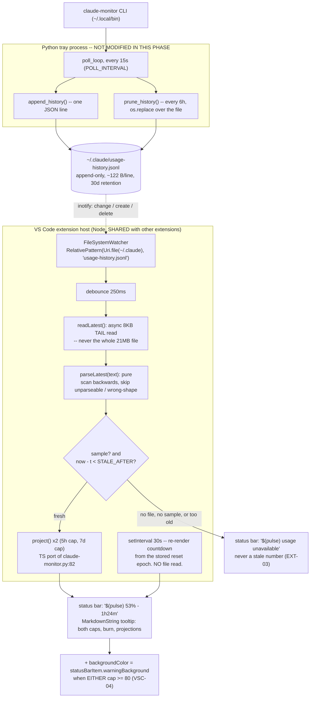

# Phase 1: Extension Foundation & Usage in the Status Bar - Research

**Researched:** 2026-07-14
**Domain:** VS Code extension API (TypeScript), out-of-workspace file watching, tolerant JSONL reading
**Confidence:** HIGH

## Summary

The load-bearing fear in the brief -- that `vscode.workspace.createFileSystemWatcher()` cannot
watch a home-directory path -- **is false**. VS Code supports out-of-workspace watching
explicitly, via `new vscode.RelativePattern(vscode.Uri.file(dir), 'filename')`. The API's own
type declarations document this with a worked example under a heading literally titled
"Out of workspace file watching". No `fs.watch`, no `setInterval` poll. The laziest option is
also the correct one, and it is the platform's own API. [VERIFIED: vscode.d.ts]

The second surprise cuts the other way. The brief assumes "the tray polls on an interval
measured in minutes". It does not: `POLL_INTERVAL` defaults to **15 seconds**
(`claude-monitor.py:46`). Over a 30-day retention window with the tray running continuously,
`usage-history.jsonl` reaches ~21 MB (172,800 lines x 122 bytes). Reading the whole file on
every append -- every 15 seconds -- would be a 21 MB parse on the shared extension host. That
is the EXT-02 landmine. The fix is not a bundler or a worker thread: the status bar needs only
the *last* record, so read the last 8 KB with `fs.promises.open`/`read` and scan backwards.
Measured on the real 357 KB file: **1.6 ms**, and it drops a truncated trailing line, a
wrong-shape record, and a junk line for free -- EXT-04 falls out of the same six lines.

The scaffold is small. Three devDependencies (`typescript`, `@types/vscode`, `@types/node`),
plain `tsc` (no bundler -- `vsce` only warns about file count), `npx @vscode/vsce package`
then `code --install-extension *.vsix`. No `yo code`, no eslint, no test framework: the pure
parsing functions get a `node --test` self-check, which is built into Node 22 and costs zero
dependencies -- the direct analogue of `claude-monitor.py`'s inline `--selfcheck` asserts.

**Primary recommendation:** `RelativePattern(Uri.file('~/.claude'), 'usage-history.jsonl')`
watcher (subscribe to change + create + delete), debounced 250 ms, driving an 8 KB tail-read
of the JSONL. Plain `tsc`, three devDeps, `vsce package` + `code --install-extension`.
Hardcode the 80% warning threshold and gate on a staleness clock, not on file existence.

## Architectural Responsibility Map

| Capability | Primary Tier | Secondary Tier | Rationale |
|------------|-------------|----------------|-----------|
| Sampling Claude usage from the CLI | Python tray (`claude-monitor.py`) | -- | Already owns it. **This phase does not touch it.** |
| Persisting samples | Python tray (`append_history`) | -- | Already owns it (HIST-01) |
| Detecting a new sample | VS Code extension host | -- | `workspace.createFileSystemWatcher` -- platform API, not a poll |
| Reading + validating a sample | VS Code extension host (async) | -- | Must be off the UI path (EXT-02); pure function, testable |
| Projection math (`project()`) | VS Code extension host | -- | Third copy, accepted by the milestone. **VSCN-05 (drift guard) is Phase 3's**, not this phase's. |
| Rendering usage % + countdown | VS Code status bar item | -- | `window.createStatusBarItem` |
| Countdown ticking between samples | VS Code extension host timer | -- | Recompute from the stored `reset` epoch locally; do NOT re-read the file to tick a clock |

## Standard Stack

### Core

| Library | Version | Purpose | Why Standard |
|---------|---------|---------|--------------|
| `typescript` | `^5.9.3` | Compile TS -> CommonJS | The extension-authoring baseline. See the version landmine below. [VERIFIED: npm registry] |
| `@types/vscode` | `^1.75.0` | VS Code API types | The API surface itself; version pins the compat floor. [VERIFIED: npm registry] |
| `@types/node` | `^22` | `node:fs/promises`, `node:os` types | Extension host is Node; needed for the tail read. [VERIFIED: npm registry] |

That is the entire dependency list. Three devDependencies, zero runtime dependencies.

### Supporting (invoked via `npx`, never installed)

| Tool | Version | Purpose | When to Use |
|------|---------|---------|-------------|
| `@vscode/vsce` | `3.9.2` | Package to `.vsix` | Only at package time: `npx @vscode/vsce package`. Do not add to `devDependencies`. [VERIFIED: npm registry] |
| `node --test` | built into Node 22 | Self-check the pure parse/project functions | Built in since Node 18. **Zero dependencies.** [VERIFIED: local `node --version` = v22.22.2] |

### Alternatives Considered

| Instead of | Could Use | Tradeoff |
|------------|-----------|----------|
| `createFileSystemWatcher` | `fs.watch` / `fs.watchFile` | **Rejected.** Unnecessary -- the VS Code API handles out-of-workspace paths (see below). `fs.watch` is the platform-dependent, unreliable one; using it here would be *choosing* the flakier option for no gain. |
| `createFileSystemWatcher` | `setInterval` poll | **Rejected.** A poll fast enough to track a 15 s producer is a needless wake-up every 15 s forever. Keep `setInterval` only for the *countdown re-render* (30 s), which reads no file. |
| plain `tsc` | esbuild / webpack | **Rejected.** `vsce` does not require a bundler -- it only *warns* about file count. [CITED: code.visualstudio.com/api/working-with-extensions/publishing-extension] A ~5-file extension gains nothing and adds a build step. |
| `typescript@^5.9` | `typescript@7.0.2` (current `latest`) | **Rejected for now.** npm `latest` is now **TypeScript 7** -- the Go-native compiler rewrite. It is a major version with a new compiler binary, and every VS Code extension sample and `@types/vscode` release is tested against 5.x. For a ~200-line extension the upside is zero and the blast radius is a toolchain you cannot debug. Pin `^5.9.3`. Revisit when the extension samples move. [VERIFIED: npm view typescript dist-tags] |
| `node --test` | mocha + `@vscode/test-electron` | **Rejected.** The properties worth testing (EXT-03/EXT-04, `project()`) are all *pure functions over strings and numbers*. They need no VS Code instance. Adding an Electron test harness to assert that `JSON.parse` failures are skipped is the failure mode this project's ethos exists to avoid. |
| `vsce package` + install | symlink into `~/.vscode/extensions/` | **Rejected.** Works, but is undocumented, silently version-sensitive, and gives no artifact to hand anyone. `code --install-extension foo.vsix` is one documented command. [CITED: code.visualstudio.com/api/working-with-extensions/publishing-extension] |
| `yo code` generator | -- | **Rejected explicitly.** It emits eslint, mocha, a bundler config, a `.vscode-test.mjs`, and a CI workflow. That is the 40-devDependency failure mode named in the brief. |

**Installation:**

```bash
cd vscode-extension
npm install --save-dev typescript@^5.9.3 @types/vscode@^1.75.0 @types/node@^22
# package + install, no marketplace, no global installs:
npx @vscode/vsce package
code --install-extension claude-usage-0.1.0.vsix
```

## Package Legitimacy Audit

| Package | Registry | Latest | Weekly Downloads | Source Repo | Verdict | Disposition |
|---------|----------|--------|------------------|-------------|---------|-------------|
| `typescript` | npm | 7.0.2 (pin `^5.9.3`) | 212,485,134 | github.com/microsoft/TypeScript | SUS (false positive) | **Approved** |
| `@types/vscode` | npm | 1.125.0 (pin `^1.75.0`) | 1,321,190 | github.com/DefinitelyTyped/DefinitelyTyped | SUS (false positive) | **Approved** |
| `@types/node` | npm | 26.1.1 (pin `^22`) | 287,847,050 | github.com/DefinitelyTyped/DefinitelyTyped | SUS (false positive) | **Approved** |
| `@vscode/vsce` | npm | 3.9.2 | 1,258,566 | github.com/Microsoft/vsce | OK | **Approved** (via `npx`, not installed) |

**On the three `SUS` verdicts:** the seam flagged `too-new` off the *most recent release date*
(all three published within the last month), not package age. With 212M/wk downloads and a
first-party Microsoft/DefinitelyTyped repo, these are the canonical packages. **No
`checkpoint:human-verify` needed.** All four were discovered from the official VS Code
extension documentation, not from a search result -- they meet the authoritative-source bar.
[VERIFIED: npm registry + code.visualstudio.com]

`npm view <pkg> scripts.postinstall` returned `none` for all four. [VERIFIED: npm registry]

**Packages removed due to SLOP verdict:** none.

## THE PRIMARY QUESTION -- SETTLED

### Verdict: `createFileSystemWatcher` WORKS on `~/.claude/`. Use it.

The premise that it only watches inside workspace folders is **half true, and the half that is
true is the half that does not apply here.** The exact distinction, quoted from the API's own
declaration file:

> Providing a `string` as `globPattern` acts as convenience method for watching file events in
> all opened workspace folders. **It cannot be used to add more folders for file watching, nor
> will it report any file events from folders that are not part of the opened workspace
> folders.**
>
> [...]
>
> #### Out of workspace file watching
>
> To watch a folder for changes to \*.js files outside the workspace (non recursively), pass in
> a `Uri` to such a folder:
>
> ```ts
> vscode.workspace.createFileSystemWatcher(new vscode.RelativePattern(vscode.Uri.file(<path to folder outside workspace>), '*.js'));
> ```

[VERIFIED: microsoft/vscode `src/vscode-dts/vscode.d.ts`, lines 13979-14076, fetched 2026-07-14]

So: **the string form is workspace-only. The `RelativePattern`-with-a-`Uri`-base form is not.**
The landmine is passing a string glob; the fix is passing a `RelativePattern`. This is a
one-argument difference, and getting it wrong is exactly the "ships a status bar that never
updates" failure the brief predicted.

Three further guarantees from the same doc block, all of which happen to favor us:

1. **Non-recursive is the cheap path, and we are non-recursive.** Watching `~/.claude` with the
   plain pattern `usage-history.jsonl` (no `**`) is a non-recursive watcher. The docs: *"it is
   highly recommended to watch with simple patterns that do not require recursive watchers"*
   because *"recursive file watching is quite resource intense."*
2. **`files.watcherExclude` cannot silently kill us.** The docs: file events from **recursive**
   watchers *"may be excluded based on user configuration"* -- and for non-recursive patterns
   *"the exclude settings are ignored and you have full control over the events."* A user with a
   broad `files.watcherExclude` cannot break this extension. [VERIFIED: vscode.d.ts:13999-14003]
3. **Path casing is preserved for out-of-workspace paths**, so the `uri.fsPath` we get back
   matches what we passed. Irrelevant on Linux, free correctness elsewhere.

### The one real subtlety: `prune_history` renames over the file

`prune_history` (`claude-monitor.py:313-335`) does **not** append -- it writes a temp file and
calls `os.replace(tmp, HISTORY_PATH)`. At the inotify level that is `IN_MOVED_TO`, not
`IN_MODIFY`. VS Code's watcher may surface a rename-over as a **create** (or a delete followed
by a create), not a **change**. [ASSUMED -- inferred from inotify semantics; not verified
against VS Code's watcher implementation]

Cost of being wrong: every 6 hours (`PRUNE_INTERVAL`) the status bar could go silent until the
next `onDidChange`. Cost of the mitigation: **one extra line.** So mitigate unconditionally --
subscribe to all three events and route create and change to the same handler:

```ts
const dir = vscode.Uri.file(path.join(os.homedir(), ".claude"));
const watcher = vscode.workspace.createFileSystemWatcher(
  new vscode.RelativePattern(dir, "usage-history.jsonl"),
);
watcher.onDidChange(refresh);   // the 15s append
watcher.onDidCreate(refresh);   // prune's os.replace may land here, not onDidChange
watcher.onDidDelete(refresh);   // -> reader returns null -> "usage unavailable"
context.subscriptions.push(watcher);
```

Note `onDidCreate` also covers the cold-start case where VS Code is open *before* the tray has
ever run and the file does not yet exist -- the watcher fires when the tray first creates it.
A watcher on a not-yet-existing file inside an existing directory is fine; we watch the
*directory* with a filename pattern, so there is nothing to bind to up front.

### Debounce

The producer appends every 15 s (`POLL_INTERVAL`), and a rename-over can emit a delete+create
pair. Debounce the handler by ~250 ms so a burst collapses to one read. Trivial:

```ts
let timer: NodeJS.Timeout | undefined;
const refresh = () => {
  if (timer) clearTimeout(timer);
  timer = setTimeout(() => void render(), 250);
};
```

## Architecture Patterns

### System Architecture Diagram



### Recommended Project Structure

The repo is flat Python at top level. Put the extension in one subdirectory so `npm` never
sees the Python and `git` diffs stay legible:

```
claude-code-tray/
├── claude-monitor.py            # untouched by this phase
├── claude-send.py
├── install.sh
└── vscode-extension/            # <- the entire new deployment target
    ├── package.json             # manifest: engines, activationEvents, main
    ├── tsconfig.json
    ├── README.md                # vsce warns without one
    ├── LICENSE                  # copy/symlink the repo's; vsce warns without one
    ├── .vscodeignore            # keep src/ and node_modules/ out of the .vsix
    └── src/
        ├── extension.ts         # activate(): watcher + status bar wiring (impure)
        ├── history.ts           # readLatest() + parseLatest()  (parse is PURE)
        ├── project.ts           # project(), hhmm()  -- TS port of the Python
        └── test/
            └── selfcheck.test.ts  # node --test; asserts EXT-03/EXT-04 + project()
```

`history.ts` and `project.ts` export **pure functions over strings and numbers**. That is what
makes the self-check possible without an Electron harness, and it mirrors how
`claude-monitor.py` already separates `parse_history` / `project` from the Gtk layer.

### Pattern 1: The manifest (EXT-01)

```jsonc
{
  "name": "claude-usage",
  "displayName": "Claude Code Usage",
  "description": "Claude Code quota usage in the status bar.",
  "version": "0.1.0",
  "publisher": "local",
  "license": "MIT",
  "private": true,
  "engines": { "vscode": "^1.75.0" },
  "categories": ["Other"],
  "activationEvents": ["onStartupFinished"],
  "main": "./out/extension.js",
  "scripts": {
    "compile": "tsc -p .",
    "test": "tsc -p . && node --test out/test/",
    "package": "npm run compile && npx @vscode/vsce package"
  },
  "devDependencies": {
    "@types/node": "^22",
    "@types/vscode": "^1.75.0",
    "typescript": "^5.9.3"
  }
}
```

**`activationEvents` IS still required here, and this is a landmine.** Since VS Code 1.74,
activation events are auto-generated *from contribution points* -- `onCommand` from
`contributes.commands`, `onLanguage` from `contributes.languages`, `onView`, `onCustomEditor`,
`onAuthenticationRequest`; and since 1.76, `onTaskType`.
[CITED: code.visualstudio.com/api/references/activation-events]

**A status bar item is not a contribution point.** It is created imperatively in `activate()`.
Nothing auto-generates an activation event for it. Ship `"activationEvents": []` (or omit the
key) and **the extension never activates, `activate()` never runs, and the status bar item
never appears** -- with no error anywhere. Phase 1 contributes no commands, so there is nothing
to auto-generate from.

Use **`onStartupFinished`**, not `"*"`. The docs are explicit that `"*"` should be used *"only
when no other activation events combination works in your use-case"*, whereas `onStartupFinished`
fires *"after all the `*` activated extensions have finished activating"* and *"will not slow
down VS Code startup."* That sentence is EXT-02's success criterion, granted by the platform for
the price of one string. [CITED: code.visualstudio.com/api/references/activation-events]

### Pattern 2: Tail-read, never full-read (EXT-02 + EXT-04 in one function)

The status bar needs exactly one thing: the **last** record. Reading 21 MB to get 122 bytes is
the whole EXT-02 risk. Read the last 8 KB (~65 records, ample margin) and scan backwards:

```ts
// history.ts
import { open, stat } from "node:fs/promises";

const TAIL_BYTES = 8192;

export type Sample = {
  t: number; pct: number; burn: number; reset: number;
  pct7: number | null; reset7: number | null;
};

const num = (v: unknown): v is number => typeof v === "number" && Number.isFinite(v);

/** PURE. Last valid record in `text`, or null. `partialHead` drops line 0, which is a
 *  mid-record slice whenever we did not read from byte 0. Mirrors parse_history's contract:
 *  a JSON object with a numeric `t`. Unparseable / wrong-shape lines are SKIPPED, never thrown.
 */
export function parseLatest(text: string, partialHead: boolean): Sample | null {
  const lines = text.split("\n");
  if (partialHead) lines.shift();
  for (let i = lines.length - 1; i >= 0; i--) {
    const s = lines[i].trim();
    if (!s) continue;
    let r: unknown;
    try { r = JSON.parse(s); } catch { continue; }   // half-written trailing line -> skip
    if (typeof r !== "object" || r === null) continue;
    const o = r as Record<string, unknown>;
    // history_numeric's contract, ported: t, pct, burn must all be finite numbers.
    if (!num(o.t) || !num(o.pct) || !num(o.burn) || !num(o.reset)) continue;
    if (!(o.t > 0 && o.t < 4102444800)) continue;    // far-future guard, ported from Python
    return {
      t: o.t, pct: o.pct, burn: o.burn, reset: o.reset,
      // Weekly is secondary: junk there degrades that block, never the 5h payload.
      pct7: num(o.pct7) ? o.pct7 : null,
      reset7: num(o.reset7) ? o.reset7 : null,
    };
  }
  return null;
}

/** ASYNC. null on any error -- a missing file is a normal state, not an exception. */
export async function readLatest(path: string): Promise<Sample | null> {
  try {
    const st = await stat(path);
    const start = Math.max(0, st.size - TAIL_BYTES);
    const fh = await open(path, "r");
    try {
      const buf = Buffer.alloc(st.size - start);
      await fh.read(buf, 0, buf.length, start);
      return parseLatest(buf.toString("utf8"), start > 0);
    } finally {
      await fh.close();
    }
  } catch {
    return null;   // ENOENT (no tray has ever run), EACCES, anything -> "usage unavailable"
  }
}
```

**Measured, not assumed.** Run against the real `~/.claude/usage-history.jsonl` (357,514 B,
2,924 records): returns the correct last record in **1.6 ms**. Then run against that same file
with a truncated record, a `{"t":"garbage","pct":{}}` record, and a `not json at all {` line
appended: **still 1.6 ms, still the correct last good record, no throw.** EXT-04 is not extra
work -- it is what backwards-scanning already does. [VERIFIED: executed locally 2026-07-14]

Note the file is mode `0600`, single-user, written by a process owned by the same user. There
is no trust boundary here, but `parseLatest` is still total over arbitrary bytes -- which is
the property EXT-04 actually asks for.

### Pattern 3: Staleness, not existence (EXT-03 -- the POLL-02 lesson, ported)

The requirement says "no tray running and no history file present -> usage unavailable". The
**and** is a trap. The dangerous case is the one the requirement's phrasing does not name:

> **The tray is dead, but the file is still there, holding yesterday's 53%.**

`readLatest` returns a perfectly valid `Sample`. Rendering it shows a confidently wrong number
forever -- the exact "showing a stale number" failure EXT-03 forbids. **File existence is not
freshness.** Gate on the record's own clock:

```ts
const STALE_AFTER = 5 * 60;  // seconds. POLL_INTERVAL is 15s, so this is ~20 missed polls.

const s = await readLatest(HISTORY_PATH);
const now = Date.now() / 1000;
if (!s || now - s.t > STALE_AFTER) {
  item.text = "$(pulse) usage unavailable";
  item.tooltip = "No recent samples -- is claude-monitor.py running?";
  item.backgroundColor = undefined;   // MUST clear: a stale warning is worse than none
  item.show();
  return;
}
```

`STALE_AFTER = 5 min` against a 15 s producer tolerates ~20 consecutive missed polls before
declaring unavailable -- which is the Python side's own "degrade only after N consecutive
misses, not the first" decision (PROJECT.md Key Decisions), ported to a wall-clock form. It
absorbs a transient CLI hiccup and still surfaces a dead tray within a coffee break.

Clearing `backgroundColor` on the unavailable path is not cosmetic: it is a real bug if
omitted. Enter the warning state at 85%, then kill the tray -- without the clear, the status
bar sits there permanently orange, warning about a number it is no longer showing.

### Pattern 4: The status bar item (VSC-01, VSC-04)

```ts
const item = vscode.window.createStatusBarItem(vscode.StatusBarAlignment.Right, 100);
context.subscriptions.push(item);

item.text = `$(pulse) ${Math.round(s.pct)}% ${countdown(s.reset, now)}`;   // e.g. "$(pulse) 53% 1h24m"

// VSC-04: warn when EITHER cap is high. The 7d cap is why this is an `||`, not `s.pct >= 80`.
const hot = s.pct >= WARN_PCT || (s.pct7 !== null && s.pct7 >= WARN_PCT);
item.backgroundColor = hot
  ? new vscode.ThemeColor("statusBarItem.warningBackground")
  : undefined;
item.show();
```

**`backgroundColor` accepts exactly two ThemeColors -- this is enforced, and the brief's
recollection is correct.** From the declaration:

> *Note*: only the following colors are supported:
> * `new ThemeColor('statusBarItem.errorBackground')`
> * `new ThemeColor('statusBarItem.warningBackground')`
>
> More background colors may be supported in the future.
>
> *Note*: when a background color is set, the statusbar may override the `color` choice to
> ensure the entry is readable in all themes.

[VERIFIED: vscode.d.ts, `StatusBarItem.backgroundColor`]

Two consequences: any other `ThemeColor` is **silently ignored** (no error, no warning -- it
just does not apply, and you will spend an hour on it); and do **not** also set `item.color`
for the warning state, because VS Code overrides it anyway.

`WARN_PCT = 80`. Hardcode it. `claude-monitor.py:50-51` carries the comment *"High-usage badge
threshold (percent). Hardcoded on purpose: do NOT add an env lookup."* Port the decision, not
just the number. (v1.3's Phase 06 may make it configurable on the Python side; that is not
this phase's problem, and a VS Code `configuration` contribution point here would fork the
threshold across two frontends.)

Codicon: **`$(pulse)`** in `text` -- the `$(icon-name)` syntax is documented directly on
`StatusBarItem.text`: *"You can embed icons in the text by leveraging the syntax: `My text
$(icon-name) contains icons like $(icon-name) this one.`"* [VERIFIED: vscode.d.ts]
`$(pulse)` reads as a live rate; `$(dashboard)` and `$(graph)` are reasonable alternates.
Do **not** switch the icon to signal the warning -- the background color is the signal, and
two channels for one bit is noise.

### Pattern 5: MarkdownString tooltip (VSC-02, VSC-03)

`StatusBarItem.tooltip` is typed `string | MarkdownString | undefined`. [VERIFIED: vscode.d.ts]
Confirmed -- multi-line structured hover content is supported first-class.

```ts
const md = new vscode.MarkdownString(undefined, true);  // 2nd arg = supportThemeIcons
md.appendMarkdown(`**Claude Code usage**\n\n`);
md.appendMarkdown(`| cap | now | burn | at reset | resets |\n|---|---|---|---|---|\n`);
md.appendMarkdown(`| 5-hour | ${fmt(s.pct)}% | ${tokPerHr(s.burn)} | ${projText(p5)} | ${hhmm(s.reset)} |\n`);
if (s.pct7 !== null && s.reset7 !== null) {
  md.appendMarkdown(`| 7-day | ${fmt(s.pct7)}% | ${tokPerHr(s.burn)} | ${projText(p7)} | ${hhmm(s.reset7)} |\n`);
}
item.tooltip = md;
```

Gotchas, all verified against the `MarkdownString` declaration:

- **`supportThemeIcons`** (the 2nd constructor arg) must be `true` for `$(icon)` to render
  *inside the tooltip*. It is independent of the `$(icon)` support in `text`. If you use no
  codicons in the tooltip, leave it off.
- **`isTrusted` defaults to `false`**, and *"Only trusted markdown supports links that execute
  commands, e.g. `[Run it](command:myCommandId)`"*. Phase 1 has no commands, so **leave
  `isTrusted` false.** Phase 2 (the dashboard command) may want a `command:` link in the hover
  -- that is when to set it, scoped, and not before.
- **`supportHtml` defaults to `false`** and raw HTML is stripped. Fine -- use markdown tables.

VSC-02 is not decoration. A 95%-weekly / 10%-five-hour state that shows no weekly row is the
QUOTA-01 failure v1.2 already had to fix once. **Render the 7-day row whenever `pct7 !== null`,
and render the warning off `||` across both caps.** If the plan produces a hover that only
shows the 5-hour cap, it has reintroduced a bug this project has already paid for.

### Pattern 6: The `project()` port (VSC-03)

Straight port of `claude-monitor.py:82-105`. Keep the discriminated return -- `null`,
`{early: true}`, `{proj, exhaust?}` -- rather than "cleaning it up" into a bare number. Each
branch is load-bearing and was learned the hard way:

```ts
// project.ts
export const WIN5 = 18000;    // 5 hours,  seconds
export const WIN7 = 604800;   // 7 days,   seconds

export type Projection = null | { early: true } | { proj: number; exhaust?: number };

export function project(pct: number | null, reset: number | null, win: number, now: number): Projection {
  if (!num(pct) || !num(reset)) return null;          // 7d cap absent on an older CLI -> silence
  const start = reset - win;
  let e = (now - start) / win;
  if (e <= 0.05) return { early: true };              // pct/e explodes this early; also the clock-skew guard
  if (e > 1) e = 1.0;                                 // window already over -> degrade to current pct
  const proj = pct / e;
  const out: { proj: number; exhaust?: number } = { proj };
  if (proj > 100 && pct > 0) {                        // `pct > 0` guards the 100.0/pct below
    const exh = start + (100 / pct) * (now - start);
    if (exh < reset) out.exhaust = exh;
  }
  return out;
}
```

Note the Python comment on the `!_is_num` guard: it is *"Stricter than the JS, which coerces:
this makes a 7d cap absent on an older CLI degrade to silence instead of raising."* Port the
**strict** version. The dashboard's JS copy is the lenient one and it is the wrong model here.

**Scope note for the planner:** VSCN-05 (the mechanical drift guard between the three copies)
is a **Phase 3** requirement. Phase 1 needs a *correct* port with a self-check on the branch
table, not the cross-language drift harness. Do not pull Phase 3's work forward.

## Don't Hand-Roll

| Problem | Don't Build | Use Instead | Why |
|---------|-------------|-------------|-----|
| Detect a new sample | `setInterval` poller; `fs.watch`; `chokidar` | `workspace.createFileSystemWatcher` + `RelativePattern(Uri.file(dir), name)` | The platform API handles out-of-workspace paths (verified above), handles the cross-platform mess, and is disposed with the extension. `chokidar` would be a runtime dependency for something VS Code hands you. |
| Read a growing append-only file | A streaming line reader; `readline` over a `createReadStream` | `stat` + one positioned 8 KB `read` | The status bar wants one record. A stream to reach the last line of a 21 MB file reads 21 MB. |
| Tolerate a corrupt line | A JSONL validator; a schema library (`zod`) | `try { JSON.parse } catch { continue }` + a `Number.isFinite` shape check | This is the six lines in `parseLatest`. A schema library for a 6-key record with no trust boundary is the failure mode. Ported directly from `parse_history` / `history_numeric`. |
| Bundle the extension | webpack / esbuild config | `tsc -p .` + `.vscodeignore` | `vsce` only *warns* about file count. Five files. |
| Test the pure functions | mocha + `@vscode/test-electron` | `node --test` (built into Node 22) | Zero dependencies. The functions are pure; they do not need an editor. |
| A settings UI for the threshold | `contributes.configuration` | Hardcode `WARN_PCT = 80` | `claude-monitor.py:50` says so explicitly, and forking the threshold across two frontends is how they drift. |

**Key insight:** every "hard" part of this phase is either already solved by the VS Code API
(watching, theming, hover rendering) or already solved *in this repo, in Python*, and needs
porting rather than inventing. The genuinely new code is ~150 lines.

## Common Pitfalls

### Pitfall 1: `createFileSystemWatcher('**/*.jsonl')` -- the string form

**What goes wrong:** Status bar renders once on activation, then never updates again. No error.
**Why:** The string form is a convenience for workspace folders only. `~/.claude` is not one.
**Avoid:** Always `new vscode.RelativePattern(vscode.Uri.file(dir), 'usage-history.jsonl')`.
**Warning sign:** It works when you happen to have opened `~` as your workspace folder, and
"mysteriously" stops for every other project. That is the tell.

### Pitfall 2: Omitting `activationEvents`

**What goes wrong:** `activate()` is never called. Nothing appears. No error, no log.
**Why:** Auto-generated activation events come from **contribution points**. A status bar item
is not one, and Phase 1 contributes no commands.
**Avoid:** `"activationEvents": ["onStartupFinished"]`.
**Warning sign:** The extension shows as installed and enabled; a `console.log` in `activate()`
never prints.

### Pitfall 3: Reading the whole history file (the EXT-02 killer)

**What goes wrong:** Every 15 s the shared extension host parses up to 21 MB. Other extensions
stutter. Fans spin. It is invisible in dev because your test file is 300 KB.
**Why:** `POLL_INTERVAL = 15` seconds x 30-day retention = 172,800 lines. The brief's assumption
of a minutes-scale poll is wrong -- **verify against `claude-monitor.py:46`, not intuition.**
**Avoid:** 8 KB tail read.
**Warning sign:** Perf is fine for the first week of history and degrades linearly. Nobody
connects the two.

### Pitfall 4: Rendering a stale sample because the file exists

**What goes wrong:** Tray dies. Status bar keeps showing 53% forever. Worst possible failure --
a confidently wrong number is more harmful than "unavailable", which is the entire point of
POLL-02 and thus of EXT-03.
**Avoid:** `now - sample.t > STALE_AFTER` -> unavailable. Freshness, not existence.
**Warning sign:** The countdown keeps ticking down (it is computed locally) while `pct` never
moves. If the countdown reaches zero and stays there, you have been showing a corpse.

### Pitfall 5: Leaving `backgroundColor` set on the unavailable path

**What goes wrong:** Permanent orange status bar warning about a number that is no longer shown.
**Avoid:** `item.backgroundColor = undefined` on every non-warning path, including unavailable.

### Pitfall 6: Warning off the 5-hour cap only

**What goes wrong:** 95% weekly, 10% five-hour -> no warning, and the user hits the weekly wall
with no notice. **This is QUOTA-01 verbatim** -- the exact bug v1.2 shipped and had to fix.
**Avoid:** `s.pct >= 80 || (s.pct7 !== null && s.pct7 >= 80)`.

### Pitfall 7: Re-reading the file to tick the countdown

**What goes wrong:** A 1 s `setInterval` that calls `readLatest` to refresh "1h24m" -> a file
read every second, for a number derivable from arithmetic.
**Avoid:** Cache the last `Sample`. A 30 s `setInterval` re-renders `countdown(s.reset, now)`
from the cached epoch and touches no disk. The watcher is the only thing that reads.

### Pitfall 8: `typescript@latest` is now TypeScript 7

**What goes wrong:** `npm i -D typescript` pulls the Go-native compiler rewrite. Any friction
lands you debugging a toolchain instead of shipping ~150 lines.
**Avoid:** Pin `^5.9.3`. [VERIFIED: `npm view typescript dist-tags` -> `latest: 7.0.2`]

## The JSONL Record Shape (from the source, not a guess)

Written by `history_record()` (`claude-monitor.py:265-277`), one JSON object per line.

| Key | Type | Meaning | Cap | Notes |
|-----|------|---------|-----|-------|
| `t` | int (epoch s) | Poll time | -- | **Always present and numeric.** `parse_history` drops any record without it. Freshness clock for EXT-03. |
| `pct` | float | Usage % | **5-hour** | `used_percentage` of the 5h cap. |
| `reset` | int (epoch s) | Window reset | **5-hour** | `resets_at_epoch`. Feeds the countdown *and* `project(..., WIN5, ...)`. |
| `pct7` | float \| **null** | Usage % | **7-day** | Optional. `null` on older CLIs. **VSC-02 depends on this.** |
| `reset7` | int \| **null** | Window reset | **7-day** | Optional. Feeds `project(..., WIN7, ...)`. |
| `burn` | float | **Tokens per MINUTE**, raw | shared | Convert `* 60` for tok/hr, as the tray does (`trend_burn`). |
| `tokens_used` | **always `null`** | -- | -- | **Do not use.** `null` under `--api`. |
| `token_limit` | **always `null`** | -- | -- | **Do not use.** `null` under `--api`. |

Real record, tail of the live file [VERIFIED: read 2026-07-14]:

```json
{"t": 1784029571, "pct": 53.0, "tokens_used": null, "token_limit": null, "burn": 493067.77123045654, "reset": 1784034599, "pct7": 50.0, "reset7": 1784285999}
```

**Everything is percentage-denominated.** `tokens_used` / `token_limit` are `null` in every
record on this account and every account running `--api` (PROJECT.md Key Decisions: *"All
projection/forecast math derives from percentages, never the CLI's token-based
forecast/status"*). A plan that surfaces "X of Y tokens" in the hover renders `null of null`.
`burn` is the one live token-denominated field and it is only used as a rate.

Note `history_record`'s own comment on `reset`/`pct7`/`reset7`: *"Optional: older records lack
these keys, so every reader must tolerate that."* The `pct7 !== null && reset7 !== null` guard
in Pattern 5 is that tolerance -- and note it must handle the key being **absent**, not just
`null`. `num(o.pct7)` handles both.

**Measured file characteristics** [VERIFIED: local, 2026-07-14]:

| Property | Value |
|----------|-------|
| Current size | 357,514 bytes / 2,924 records / 49.6 h span |
| Mean line | 122 bytes |
| Producer cadence | 15 s (`POLL_INTERVAL`, `claude-monitor.py:46`) |
| Retention | 30 days (`HISTORY_DAYS`) |
| **Worst-case size** | **~21 MB** (172,800 lines, tray running 24/7 for 30 d) |
| Permissions | `0600`, single user |
| Rewritten in place | Yes -- `prune_history` `os.replace`, every 6 h |

## Environment Availability

| Dependency | Required By | Available | Version | Fallback |
|------------|------------|-----------|---------|----------|
| Node.js | Build + `node --test` | yes | v22.22.2 | -- |
| npm | devDeps | yes | 10.9.7 | -- |
| npx | `@vscode/vsce` without installing | yes | 10.9.7 | -- |
| `code` CLI | `code --install-extension` (EXT-01) | yes | 1.128.0 | "Install from VSIX..." in the Extensions view |
| `~/.vscode/extensions` | Install target | yes | -- | -- |
| `~/.claude/usage-history.jsonl` | The data (VSC-01) | yes | 357 KB, live | -- |
| TypeScript (global) | -- | no | -- | Not needed -- devDependency + `npx tsc` |

**Missing dependencies with no fallback:** none. Every tool this phase needs is installed.

Note `code --version` reports **1.128.0**, comfortably above the recommended
`engines.vscode: ^1.75.0` floor. Pinning the floor at 1.75 (not 1.128) costs nothing and keeps
the extension installable on an older VS Code; `@types/vscode@^1.75.0` types then match the
floor, so the compiler physically cannot let you use an API newer than your declared `engines`.
That is the whole reason the two versions are kept in lockstep. [VERIFIED: local + npm registry]

## Project Constraints (from CLAUDE.md)

- **ASCII only.** No Unicode in code or output. `->` not the arrow glyph, etc. The Python file
  confines its only non-ASCII to `SPARK_GLYPHS`; the extension should have **none at all**.
  Codicons (`$(pulse)`) are ASCII source that VS Code renders as glyphs -- these are fine and
  are not a violation.
- **Codedoc comment style.** C-family languages use **block comments (`/* */`)** for
  documentation blocks; keep `//` for short non-prose annotations. This applies to the
  TypeScript. The doc comments in the sketches above should be `/* */` blocks in the real files.
- **Conventional Commits**, grouped contextually.
- **Minimal changes; stdlib first.** Reinforced by the phase brief: a 40-devDependency scaffold
  is a failure mode. Three devDeps.
- **Ask before destructive actions.**

## State of the Art

| Old Approach | Current Approach | When Changed | Impact |
|--------------|------------------|--------------|--------|
| `createFileSystemWatcher` watches workspace only | `RelativePattern` with a `Uri` base watches **any** folder, non-recursively | VS Code 1.64 (Jan 2022) | **The premise of this phase's biggest risk is obsolete.** No `fs.watch` needed. |
| Declare every `activationEvents` entry | Auto-generated from contribution points | 1.74 (commands/views/languages), 1.76 (tasks) | Does **not** cover status bar items -> `onStartupFinished` still required. |
| `vsce` (the package) | `@vscode/vsce` | 2022 | The unscoped `vsce` package is the legacy name. Use the scoped one. |
| `typescript@latest` == 5.x | `typescript@latest` == **7.0.2** (Go-native rewrite) | 2026 | Pin `^5.9.3` deliberately. Do not take `latest`. |

**Deprecated/outdated:**
- `"activationEvents": ["*"]` -- discouraged by the docs; `onStartupFinished` is the correct
  event for "activate in the background at startup without slowing startup".
- The unscoped `vsce` npm package -- superseded by `@vscode/vsce`.

## Assumptions Log

| # | Claim | Section | Risk if Wrong |
|---|-------|---------|---------------|
| A1 | `prune_history`'s `os.replace` surfaces as `onDidCreate` (or delete+create) rather than `onDidChange` in VS Code's watcher | Primary Question | **Already mitigated** -- subscribing to all three events makes the answer irrelevant. Zero risk as specified; would only matter if a plan "optimized" down to `onDidChange` alone, which would silently break the status bar every 6 h. |
| A2 | `STALE_AFTER = 5 min` is the right freshness threshold | Pattern 3 | A tunable, not a landmine. Too low -> flaps to "unavailable" on a slow CLI run (the CLI takes 5-10 s and `POLL_TIMEOUT` is 15 s, so 5 min is ~20 misses -- ample). Too high -> a dead tray is discovered late. Worth a UAT sanity check, not a design change. |
| A3 | `$(pulse)` is the best codicon for usage | Pattern 4 | Cosmetic. Any of `$(pulse)`, `$(dashboard)`, `$(graph)` work. |
| A4 | 8 KB is enough tail to always contain a full valid record | Pattern 2 | ~65 records at 122 B. Would only fail if >65 consecutive records were corrupt, at which point "usage unavailable" is the *correct* answer anyway. No widening loop needed. |

## Open Questions

1. **Does the extension need to handle `~/.claude` not existing at all?**
   - Known: `readLatest` returns `null` on `ENOENT` for the *file*, so the render path is safe.
   - Unclear: `createFileSystemWatcher` on a `Uri` pointing at a **nonexistent directory** --
     does it bind and start firing once the directory appears?
   - Recommendation: **do not care.** `~/.claude` exists on any machine that has ever run Claude
     Code, which is the only machine this extension is installed on. If the watcher fails to
     bind, the status bar reads "usage unavailable" -- the correct output for that state. Do not
     spend a task on it.

2. **Should the status bar item hide entirely when unavailable, rather than saying so?**
   - EXT-03 says "degrades to an explicit *usage unavailable* state". So: **show the text.**
   - Flagging it because a UAT reviewer may prefer the item disappear. That would be a
     requirement change, not an implementation choice.

## Sources

### Primary (HIGH confidence)
- `microsoft/vscode` `src/vscode-dts/vscode.d.ts` (main, fetched 2026-07-14) -- `createFileSystemWatcher` doc block (L13976-14076), `StatusBarItem` (`text`/`tooltip`/`backgroundColor`/`command`/`alignment`), `MarkdownString` (`isTrusted`/`supportThemeIcons`/`supportHtml`)
- `claude-code-tray/claude-monitor.py` -- `POLL_INTERVAL` (L46), `USAGE_THRESHOLD` (L50), `project()` (L82), `hhmm()` (L108), `HISTORY_PATH`/`HISTORY_DAYS` (L135-141), `history_record()` (L265), `parse_history()` (L285), `append_history()` (L304), `prune_history()` (L313), `history_numeric()` (L436)
- Live `~/.claude/usage-history.jsonl` -- record shape, size, cadence, measured tail-read latency
- `npm view` -- versions, dist-tags, repos, postinstall for all four packages
- Local `node`/`npm`/`code --version` -- environment audit

### Secondary (MEDIUM confidence)
- code.visualstudio.com/api/references/activation-events -- auto-generated activation events (1.74/1.76), `onStartupFinished`, `"*"` discouraged
- code.visualstudio.com/api/working-with-extensions/publishing-extension -- `vsce package`, `code --install-extension`, bundler is optional

### Tertiary (LOW confidence)
- inotify `IN_MOVED_TO` semantics vs VS Code's watcher event mapping (assumption A1 -- mitigated by design, not relied upon)

## Metadata

**Confidence breakdown:**
- File watching: **HIGH** -- read from the API's own type declarations, with the exact
  workspace-vs-out-of-workspace distinction quoted. The premise of the phase's biggest risk is
  disproven, not hedged.
- Record shape: **HIGH** -- read from `history_record()` and cross-checked against live data.
- Tail read / EXT-02 / EXT-04: **HIGH** -- executed against the real file *and* against a
  deliberately corrupted copy. 1.6 ms, correct result, no throw.
- Status bar / tooltip / warning color: **HIGH** -- from `vscode.d.ts`, including the
  "only two background colors are supported" constraint the brief asked to verify.
- Scaffold / packaging: **MEDIUM-HIGH** -- from official docs; `vsce package` not run end to end
  (there is no extension to package yet).
- Staleness threshold: **MEDIUM** -- design judgment ported from the Python side's "N
  consecutive misses" decision; the exact constant is a tunable.

**Research date:** 2026-07-14
**Valid until:** ~2026-08-14 (VS Code API is stable; the moving part is the TypeScript 7
transition, which is why the version is pinned rather than floated)
